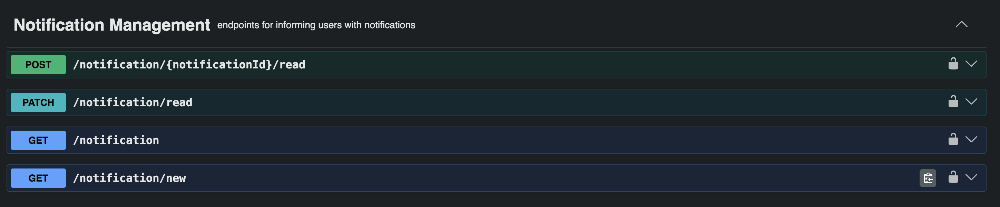
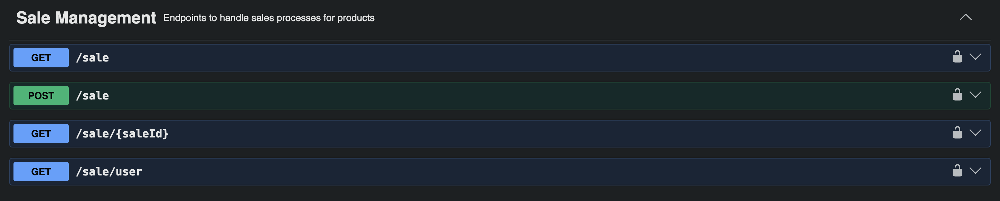
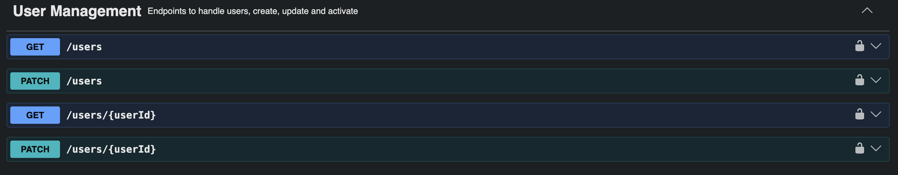
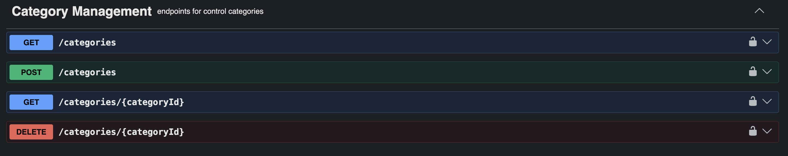
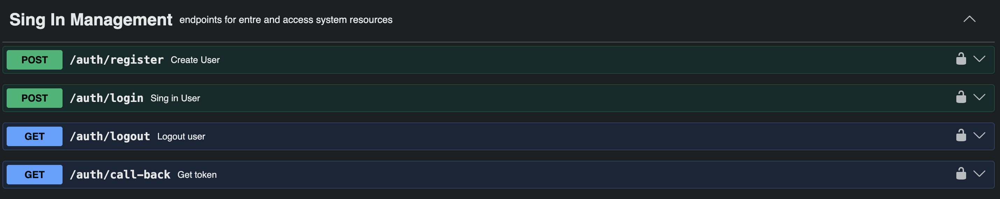
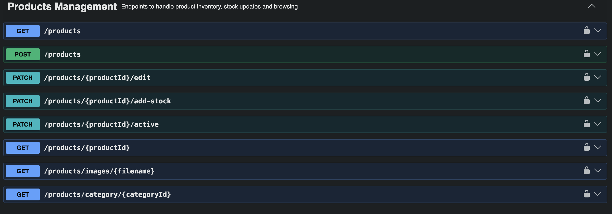
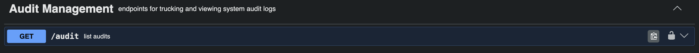

# PharmaFlow API

> **Scalable Backend Pharmacy Warehouse & Inventory Management System**

PharmaFlow API is a high-performance, containerized backend infrastructure built with **Spring Boot 4.0.1** and **Java 21**. It delivers an enterprise-grade ecosystem designed to handle high-throughput pharmacy warehouse demands — engineered with data layer safety, distributed caching, multi-channel authentication, and automated inventory logistics.

---

## Table of Contents

- [Key Architectural Features](#key-architectural-features)
- [System Architecture & Tech Stack](#system-architecture--tech-stack)
- [Core Engineering Principles](#core-engineering-principles)
- [API Documentation](#api-documentation)
- [Repository Structure](#repository-structure)
- [Configuration & Environment Setup](#configuration--environment-setup)
- [Quickstart Containerized Deployment](#quickstart-containerized-deployment)
- [Default Development Authentication](#default-development-authentication)

---

## Key Architectural Features

| Feature | Description |
|---|---|
| **Low-Level Pipeline Optimization** | Optimized database query loops leveraging high-performance Java Streams, minimizing memory footprints and reducing JVM garbage collection cycles during bulk data processing. |
| **Dual-Tier Identity Access Control** | Blends standalone JWT bearer authorization for custom local accounts with a seamless OAuth2 Social SSO workflow for Google authentication. |
| **Automated Stock Ledger Engine** | Custom entity lifecycle listeners intercept database operations to automatically pipe real-time product shifts into an immutable audit tracking model. |
| **Layered Distributed Cache Architecture** | Full Redis 7 abstraction layer intercepts highly requested product data lookups, bypassing expensive database queries and dropping latency to sub-millisecond speeds. |
| **Asynchronous Notification Delivery** | Background messaging event publisher fires non-blocking email notifications upon events like system onboarding or stock exceptions, without delaying the main HTTP thread. |

---

## System Architecture & Tech Stack

```
                       ┌───────────────────────┐
                       │  Client (Postman/UI)  │
                       └──────────┬────────────┘
                                  │ HTTPS Requests + JWT Bearer
                                  ▼
                       ┌──────────────────────┐
                       │    PharmaFlow API    │  (Spring Boot 3 / Java 21)
                       └───────┬──────────┬───┘
                               │          │
         Read / Write Queries  │          │  Read Cache Hits
         (ACID Transactions)   ▼          ▼
                    ┌─────────────┐    ┌─────────────┐
                    │ PostgreSQL  │    │ Redis Cache │
                    │ (Data Store)│    │ (Transient) │
                    └─────────────┘    └─────────────┘
```

### Tech Stack

| Layer | Technology |
|---|---|
| **Core Framework** | Spring Boot 3.x, Spring Security, Spring Data JPA |
| **Database Engine** | PostgreSQL 15 (managed via persistent Docker volumes) |
| **Cache Processing Tier** | Redis 7 (standalone Alpine memory cache worker) |
| **Identity Provisioning** | JWT, OAuth2 Client Protocol (Google Core Identity Integration) |
| **Communication & Storage** | Spring Boot Starter Mail (SMTP), Native Filesystem Multiparts |
| **Build & Tooling** | Apache Maven, Lombok, Springdoc-OpenAPI v2 |

---

## Core Engineering Principles

### 1. Database Indexing & Performance Mapping

To support rapid searching across thousands of pharmaceutical records:

- **Composite Constraints** — Structured unique indices across `(name, category_id, size, dosage_unit)` block duplication errors at the storage level.
- **Query Acceleration** — Primary fields used in filtering schemas (category assignments, barcode strings) are explicitly indexed to guarantee `O(1)` or `O(log n)` search speeds.

### 2. Strict ACID Database Transactions

Data integrity across inventory balances and financial records is enforced via declarative boundaries:

- **`@Transactional` Security** — Sales processing, inventory check-outs, and batch modifications run inside absolute database transactions. A single sub-item failure mid-sale triggers a full rollback to eliminate stock mismatches.
- **Isolation Levels** — Read/write operations use strict boundary configurations to prevent phantom reads or dirty state modifications across concurrent requests.

### 3. Role-Based Access Control (RBAC)

The security layer enforces structural privilege boundaries across custom domains:

- **Base System Roles** — Strict permission matrix across `ADMIN`, `PHARMACIST`, and `USER`.
- **Method-Level Security** — Controller pathways are locked via `@PreAuthorize("hasRole('...')")` annotations, preventing users from accessing warehouse operations above their clearance level.

### 4. Enterprise File Handling (Multipart Storage)

- **Multipart File Ingestion** — Safely streams binary multipart data (product reference sheets, images, documents) through localized HTTP endpoints.
- **Isolated Volume Directory Persistence** — Automatically re-maps and isolates uploaded media onto a dedicated persistent Docker volume (`upload_vol`), keeping the compiled application JAR lightweight and stateless.

---

## API Documentation

PharmaFlow exposes a fully mapped interactive interface detailing parameter payloads, role restrictions, and expected response models via **Swagger OpenAPI**.

> **Live Sandbox Console:**
> Boot the environment and navigate to:
> ```
> http://localhost:9090/api/v1/swagger-ui.html
> ```

---

### Notification Management
> Endpoints for informing users with notifications

<p align="center">
  
</p>

| Method | Endpoint | Description |
|---|---|---|
| `POST` | `/notification/{notificationId}/read` | Mark a notification as read |
| `PATCH` | `/notification/read` | Mark all notifications as read |
| `GET` | `/notification` | List all notifications |
| `GET` | `/notification/new` | List unread notifications |

---

### Sale Management
> Endpoints to handle sales processes for products

<p align="center">
  
</p>

| Method | Endpoint | Description |
|---|---|---|
| `GET` | `/sale` | List all sales |
| `POST` | `/sale` | Create a new sale |
| `GET` | `/sale/{saleId}` | Get sale by ID |
| `GET` | `/sale/user` | Get sales for current user |

---

### User Management
> Endpoints to handle users — create, update, and activate

<p align="center">
  
</p>

| Method | Endpoint | Description |
|---|---|---|
| `GET` | `/users` | List all users |
| `PATCH` | `/users` | Update current user |
| `GET` | `/users/{userId}` | Get user by ID |
| `PATCH` | `/users/{userId}` | Update user by ID |

---

### Category Management
> Endpoints for controlling product categories

<p align="center">
  
</p>

| Method | Endpoint | Description |
|---|---|---|
| `GET` | `/categories` | List all categories |
| `POST` | `/categories` | Create a new category |
| `GET` | `/categories/{categoryId}` | Get category by ID |
| `DELETE` | `/categories/{categoryId}` | Delete category by ID |

---

### 🔐 Sign In Management
> Endpoints for entry and access to system resources

<p align="center">
  
</p>

| Method | Endpoint | Description |
|---|---|---|
| `POST` | `/auth/register` | Create a new user |
| `POST` | `/auth/login` | Sign in and receive JWT |
| `GET` | `/auth/logout` | Logout current user |
| `GET` | `/auth/call-back` | OAuth2 callback — get token |

---

### Products Management
> Endpoints to handle product inventory, stock updates, and browsing

<p align="center">
  
</p>

| Method | Endpoint | Description |
|---|---|---|
| `GET` | `/products` | List all products |
| `POST` | `/products` | Create a new product |
| `PATCH` | `/products/{productId}/edit` | Edit product details |
| `PATCH` | `/products/{productId}/add-stock` | Add stock to product |
| `PATCH` | `/products/{productId}/active` | Toggle product active state |
| `GET` | `/products/{productId}` | Get product by ID |
| `GET` | `/products/images/{filename}` | Retrieve product image |
| `GET` | `/products/category/{categoryId}` | Get products by category |

---

### Audit Management
> Endpoints for tracking and viewing system audit logs

<p align="center">
  
</p>

| Method | Endpoint | Description |
|---|---|---|
| `GET` | `/audit` | List all system audit logs |

---

## Repository Structure

```
PharmaFlow-API/
├── .env.example                 # Template for required environment variables
├── docker-compose.yml           # Production & dev orchestration layer matrix
├── Dockerfile                   # Multi-stage automated Java build blueprint
├── mvnw                         # Maven wrapper engine execution script
├── pom.xml                      # Core system dependencies manifest
└── src/main/java/com/pharmaflow/demo/
    ├── Controllers/             # REST Controllers mapping requests to targets
    ├── Entities/                # Relational JPA entities mapping Postgres models
    ├── Repositories/            # Data access abstractions extending JpaRepository
    ├── Services/                # Core domain business logic processing layer
    └── Security/                # JWT Token filters, CORS, and OAuth2 services
```

---

## Configuration & Environment Setup

The application uses isolated external variables to separate infrastructure credentials from application logic. Create a `.env` file in the project root based on the provided template:

```bash
cp .env.example .env
```

### Environment Variables Reference

```ini
# Core Application Profile
SPRING_PROFILES_ACTIVE=dev
SERVER_PORT=0000

# PostgreSQL Cluster Access
DB_NAME=DB_NAME
DB_USER=DB_USER
DB_PASSWORD=DB_PASS
SPRING_DATASOURCE_URL=DB_DRIVER

# Redis Cache Engine
REDIS_HOST=REDIS_HOST
REDIS_PORT=REDIS_PORT

# JWT Cryptographic Keys
JWT_SECRET_KEY=JWT_SEC_KEY
JWT_EXPIRATION_MS=0000000

# Google OAuth2 SSO
SPRING_SECURITY_OAUTH2_CLIENT_REGISTRATION_GOOGLE_CLIENT_ID=your_real_google_client_id
SPRING_SECURITY_OAUTH2_CLIENT_REGISTRATION_GOOGLE_CLIENT_SECRET=your_real_google_client_secret
```

---

## Quickstart Containerized Deployment

Stand up the complete cluster — API instance, PostgreSQL, and Redis — in a single command:

```bash
# Clone the repository and navigate into the root directory
cd PharmaFlow-API

# Copy the environment template
cp .env.example .env

# Bring up the full stack with a clean rebuild
docker compose down -v
docker compose up -d --build
```

### Verifying Initialization

To confirm the database schemas, constraints, and Redis connections are ready:

```bash
docker logs -f pharmaflow-api
```

---

## Default Development Authentication

On first boot, an automated database initializer seeds the default admin profile. Use these credentials to test endpoints via Postman before integrating third-party social tokens.

| Field | Value |
|---|---|
| **Email** | `admin@pharmaflow.com` |
| **Password** | `admin` |

### Generating a JWT Token

```bash
curl -X POST http://localhost:9090/api/v1/auth/login \
     -H "Content-Type: application/json" \
     -d '{"email": "admin@pharmaflow.com", "password": "admin"}'
```

Copy the returned `token` value and attach it as a Bearer Token header in your API client:

```
Authorization: Bearer <your_token_here>
```

---

<p align="center">Built with Spring Boot 4 · Java 21 · PostgreSQL 15 · Redis 7</p>